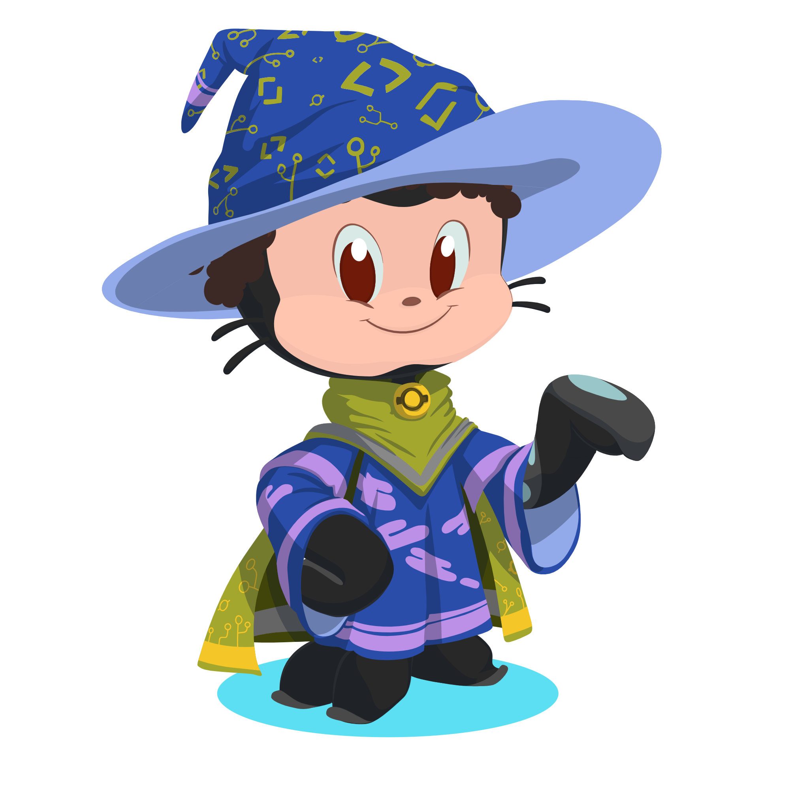

<<<<<<< HEAD
# 🚪 Olá eu sou o Pedro Missola.

sejam bem-vindos a torre magica !!

---

## 📖 Minha historia.

Sou um apaixonado por tecnologia, desenvolvimento de software e design. Estudante do IFSP - Instituto Federal São Paulo, campus Campinas.

Estou constantemente buscando aprender novas tecnologias e aprimorar minhas habilidades de programação. Minhas áreas de interesse incluem desenvolvimento web, aprendizado de máquina, desenvolvimento de sistemas, desenvolvimento mobile, , engenharia eletrica, design, iluminação, UX/UI e ciencia de dados.

## 🌟 Minhas magias.

- Dominadas:

    
    
    
    
    
    
    
    
    

- Dominando:

    
    
    
    
    
    
    
    
    

- Interesse:

    
    
    
    
    
    
    
    
    
    
    
    
    
    
    
    
    
    

## 🌍 Teletransporte

- [Linkedin](https://www.linkedin.com/in/seu-linkedin)
- [Portifolio](#)
- [Instagram](https://www.instagram.com/missolapedro/)
- [Comunidade](https://discord.gg/qFuDHHdBD2)
- [Spotify](https://open.spotify.com/user/lf1ckxgaqohrzulfzn8akwk3i?si=d9af86c71d9841ee)

## 🔗 omunicação

- 📱 Telefone: 19 999811-92492
- 📧 E-mail: missolapedro@gmail.com
- 💬 Discord: petter1212

## 📊 Estatisticas

    
    
    

